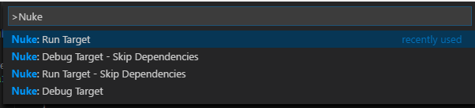
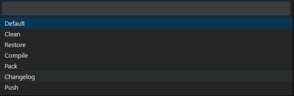
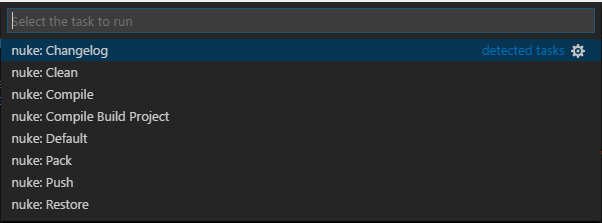

[![Release](https://img.shields.io/vscode-marketplace/v/nuke.support.svg?label=release&colorB=0A7BBB&style=flat-square&logo=data%3Aimage%2Fpng%3Bbase64%2CiVBORw0KGgoAAAANSUhEUgAAAEAAAABACAQAAAAAYLlVAAAABGdBTUEAALGPC%2FxhBQAAACBjSFJNAAB6JgAAgIQAAPoAAACA6AAAdTAAAOpgAAA6mAAAF3CculE8AAAAAmJLR0QAAKqNIzIAAAAHdElNRQfiCAoFEhc1eYxzAAAFDUlEQVRo3sWZW2wUVRjHf9PSQlvA1CKltCuIiAGBAlooFhAqpasmvpgQ9UF9AIMhqIgvJj6okTdNNAYSKxoMEEChiAIJUTEaCEbxAoLFqCy19Eq5lN4o292%2FDzvdzM7slu7uTPkez%2FnO%2BX7znXP%2B5zLgoQlN1yGtk0%2BGvAw0CMAMtSiok3pTc5QthhnDBIhYi3boceUPK0QMgCT16Khe1lRlDhOEA0CSQjqnD7REucOQi7gAEbuqg3pGRTIMbwGYwREKE1QHqaN2hNdZGMSymM0dGbcQAICUAYTQTG3QXGXdApExwx%2BX1KxP5dfYeHN6kEk4YE2ph5%2BlH6PddOlbrVaJXXA9AhBCsy3hIxbUGb2t2cqQtwBCqFQ%2FJejwhMYnB5DkJBTAPLZQlsAhnyQXdlLuArifGuYlnbihAAgggzDEl0cz%2FEfMdS%2B8CSCAbHwsZiFfcFhhJ4IAyqhhjpvho53L0BrVq19Sm17VaDk9UJl%2B183sX01MYRUIoak6bBb2aZumWIVFCM3XSUfza%2BpyBcB0nqxDluVUNbCihVC5Tjkan9VzOuomAJqkA9GqVq1XngbC%2F2Fr2K%2BvNEu5%2Bs41ABPBp%2F3Ryj5t1WShhTpta9ahjSoQLgOYCCXaZ3E4rrWO5P%2BllcoSHgCYCMXaG5Ps2NQfUGlkgroDYFNCA0Ej6wjzhKlHmZbqa2ziXS4lkqpUzCHFBoImXiTESlucs7xBLUF3j5FxNiMDoJk99NgqDvOl2%2BHjAghgKRvJs1U8z3uUuH2adwAIYBkfMs3hm8NqdlKBqxdNG4AAKi3hQ7QSilYbLGIXqxjlHkIMQDT8PWZBLzU8Rm1M1kt4n3co8uAkLIQq9Xd0jV7QGuUIFekzhWNWb1hHtMBlIRJCD0fDh3VMSyKnXKEJ2m1DkAJ6VvmuAQih5frHLO5VjXwD810RhF0OhE5t1m%2BuAAihKgUGCrVWubIPTqF2OhBCNqFOQ4oNRnGSbAr5mdf4HlkFx0DQykuIJ2PU0b2bpRAaqfv0lCbHlxohNF7bHVlwJwMGQB9nOJMI0UDQxnrE0y5%2BeTJdGRhwkfXsIHxLAMxMtfMK291DSDqZBrSzgW1xEXo44dhDvTChAn2ikGUyhdWsrfJrjO047837gInwsYkQ1Gm9pVLnS4mHACB0u7aoQ99olYrjvwV7CmBmYWH8x5mhA6TxTGfAJY6n8QUAjNAYcgjSRdDNs24SAISZwBymYNCi8zTQTgfXY%2FcCbwG6OUUdxZRTxQsU0EUjAQIK0EAzl%2Bkk6CVOtGdBJsVU8CiL8ZGB6OEqbTRyngDnuUArV%2Bihf%2BhDdZO3YoBmw9YAMvFRgZ8KfJZrSz9dXKGFCwQIUE8jF%2BngeuIHnZQALBgjuJNF%2BHmQkpjLWcT66KSdZv4jQIAGmrhEJzfsQ5UigKV5FpNYzCOUMzEOxoBbLx200WQOVQOtXKabfiA9gChGNnexBD8LKLrp5hWimyu00kA95wiQx2bGpQUQHZRs7uYh%2FMyncMh7aB99jB7Ue2gAFoyRTGUpfsoY74puJQNgwRjFNJZRzQOMSwMjSB21KTYXQA73Ukk18yhIGqODY%2Bzma1rSSqMAcplOJdXMJX9IGGHqOcjnkbOT4cY4CiCPGSxnBaXkD%2BLay6%2Fs4QABQq6LuxAao3K9rh90Nc7On%2BDXrcsgAhjLTKpYzkxuwwBuUMd%2B9vEnN4ZpyxdC%2BVqhTQroF60d7Pf9%2F%2FjWo01%2B4cF9AAAAJXRFWHRkYXRlOmNyZWF0ZQAyMDE4LTA4LTEwVDA1OjE4OjIzLTA0OjAwqL3qhAAAACV0RVh0ZGF0ZTptb2RpZnkAMjAxOC0wOC0xMFQwNToxODoyMy0wNDowMNngUjgAAAAASUVORK5CYII%3D)](https://marketplace.visualstudio.com/items?itemName=nuke.support)

[![Rating](https://img.shields.io/vscode-marketplace/r/nuke.support.svg?label=rating&style=flat-square&colorB=44CC11&logo=data%3Aimage%2Fpng%3Bbase64%2CiVBORw0KGgoAAAANSUhEUgAAAEAAAABACAYAAACqaXHeAAAFKElEQVR4XuWbV6hdRRSGv98uBrsRWwjGhkGQGEUjiUFiQcUHEcQXwQdFo5FYiFGDLXZRCRpFUBFEHwQRfUhUVGJFLCiCNSpGsXdRQixZssKcsO%2F2lD2z2zn3Lgj3hjsza%2F5vrZm9p2wxwU1t6jezHYC%2FJf3RVj%2FaBnAVsF7S0gkHwMwmAV8G4Xu1lQWtZYCZLQE6kb9C0g1tZEErADLR3z6I%2FhVoJQvaAnAZkI%2F4Ykk3N50FjQMws62Br4FO9DuafwSmSFrbJIQ2AFwK3NRD5CJJt45bACH6XwA79xDZeBY0mgFmdgkwKMIXS7q9qSxoDECB6LcyFzQJ4EKgaGQXSlrWRBY0AsDMtgC%2B6jP281q%2FAaZK%2BqtuCE0BuACIjegCSXeNPIAQ%2Fc%2BB3SLFNJIFtWeAmZ0HpEZyvqR7IsFFFa8VQInod0R4Fvjb4T9RqiIK1w3gXODuiP50K3qOpHtLttGzem0AzGwzwN%2F6Ysd%2BvrPexrS6sqBOAGcDVUXuLEn31ZEFlQIwsynAfuHfYl%2FjV9RpzwJfQK0GPpbk%2F6%2FEogGY2eQgcN%2Fcz30AX%2Bo2Yb5k%2FsRhdKB0fpf0fUwHugIIOzYH5AR6ZF30djEOWij7Ww7MhqwBPuy27ygzOxY4JIidBrjwXVroeBMuf3AQIXsczFsOYC7wFLBlEz0YIh%2FrgOM3DIEAYUWDY7htDj6HnCBp1cY5wMxmAc9OAAgufp6kVz0KYybBAOFpwA8txqP5EdxxHfH%2FAxCGw6HA8%2BMQgos%2FWtIb2cj2egyONwi%2Fh7QfI75rBnTomJlD8Dlh2xEfCy7%2BKEnvdNPR903QzA4GXhhhCL%2BEtO8qvm8GZDLBIfic4Gf5o2Qufrak9%2Fp1utBawMymAy%2BNEAQ%2FYJk7SHyhDMhkgkNYFbGz21a2fBfG%2FEdFOlAoAzIQ9gdeHmIILn6WpM%2BKiI%2FKgBwEnxh3LeqkoXJ%2B7jAnRnwSgPCytDfgr5LDAsHFHylpTSzsqCGQbdzMHMKLwB6xTisu76L9OR8tPjkDMsPB9w4%2BqFhQbHO%2Bbd65bBVbd%2BxiKLa2mR0EvBtbr%2BLy0yW9n9pm8hAIc8HpwCOpziuqd5qkR1PbKgvgeuDyVOcV1Vsq6crUtsoCeAI4OdV5RfUel3RKaltlAXwK%2BNOgTVstyXeskywZQDj49I3Ftm29b%2BOlXqYoA8D3C15vW33wP0PS2yl9KQPgTOCBFKc11DlD0kMp7ZYBcBtwUYrTGurcIskvYEZbGQC%2Be%2BynSsNgKySdmNKRMgB8AbJ7itMa6qyRNDWl3SQAZrYNUPYzF5%2B0%2FPbYVsCNwMwUAZk6kyT9GdtGKoDZYSUY68%2FL%2B%2BHkEkmPZSub2anAdYBvuqTYEZJei62YCiDl7o%2Bv2K4BHpT0b7eOmtmmgD9d%2FFuiPSPFJN0iSQWwHJhfsIM%2FhY8jlksq9OJkZn5SvQDwDyt2LOhnmaSFBctuLJYKwLfE5gxw5nPEHYA%2FopLmCzPzQ5lFgAvzeaefPSdpXlMAPKq9IuP3e%2F1y1LWSfHu6tJmZf19wNeAXrzbv0eC3kqJvpEVngJm5E%2F%2FkJW%2F%2BTv5wmOAqu8SUmyj9EpZ%2Fa%2BT7EJt06cNOkn6OIZ4C4BjgmZyTJz1VJRXai4%2FpYI%2FJ8kAfWkD%2B5ccPQ3x4FrYUANl7%2F%2F7Y8Vvdbxb2WGFBMzscuDPzDnG%2BJJ%2BgC1sKgPuBGb4TJGllYU81FjSzk8LQeEWSP6ILWwqAwyQNyzJ4jFA%2F0s9fgBhEIhrAoAZH7e%2F%2FAQpbntC9rRA3AAAAAElFTkSuQmCC)](https://marketplace.visualstudio.com/items?itemName=nuke.support)

## Table of Contents
  - [What is NUKE](#what-is-nuke)
  - [Features](#features)
  - [Commands](#commands)
  - [Codelens](#codelens)
  - [Task Provider](#task-provider)
  - [General Configuration](#general-configuration)
  - [Contributing](#contributing)
  - [License](#license)

## What is NUKE

- Cross-platform build automation in pure C#
- Extensive wizard for setup of initial build implementation
- Bootstrapping for .NET Core and .NET Framework/Mono
- CLT wrappers for over 30+ of the most popular .NET tools

### Features

- Task provider to simply run Nuke targets
- Codelens on build targets to directly run or debug them
- Commands to debug and run targets with or without its dependencies

### Commands

| Command                                | Description                                   |
| -------------------------------------- | --------------------------------------------- |
| Nuke: Run Target                       | Run a Nuke target                             |
| Nuke: Run Target - Skip Dependencies   | Run a Nuke target and skip its dependencies   |
| Nuke: Debug Target                     | Debug a Nuke target                           |
| Nuke: Debug Target - Skip Dependencies | Debug a Nuke target and skip its dependencies |

Simply debug and run Nuke targets from everywhere in your project.

### Codelens
The extension uses codelens to allow running and debugging targets directly from any Nuke build class in the current workspace. Both the 'Run Target' and 'Debug Target' codelenses can be individually configured in the settings:
- `nuke.codeLens.runTarget`
- `nuke.codeLens.debugTarget`

The configuration object accepts these properties:  

| Name             | Description                                       | Default |
| -----------------| ------------------------------------------------- | ------- |
| enabled          | Defines if the codelens is enabled                | `true`  |
| skipDependencies | Defines if target should run without dependencies | `false` |

### Task provider

### General Configuration
| Name                         | Description                                                       | Default                                        | 
| ---------------------------- | ----------------------------------------------------------------- | ---------------------------------------------- |
| nuke.buildProjectPattern     | Glob pattern to detect Nuke build project                         | `*build/*build*.csproj`                        |
| nuke.targetRegularExpression | Regular expression pattern to get targets from Nuke build classes | `Target\\s+([\\w\\-_]+)\\s*=>\\s*_\\s*=>\\s*_` |

### Contributing

[![Contributors](https://img.shields.io/github/contributors/nuke-build/vscode.svg?style=flat-square&label=contributors&logo=data%3Aimage%2Fpng%3Bbase64%2CiVBORw0KGgoAAAANSUhEUgAAAFgAAABACAYAAACeELDCAAAAAXNSR0IArs4c6QAAAARnQU1BAACxjwv8YQUAAAAJcEhZcwAAHYcAAB2HAY%2Fl8WUAAAAZdEVYdFNvZnR3YXJlAHBhaW50Lm5ldCA0LjAuMTnU1rJkAAAEFUlEQVR4Xu2bjY3UMBCFrwRKoAQ6gA6gA64D6AA6gA6gA%2BgAOoAOjg6gg2XeSl7lfN%2FGdjweR9E%2B6ZNO7%2BIZjzc%2Fjr17dzqdtvLc%2BGD8MJL0tzz9j9rsmSH1oFnBO6MkHUNt98iwetAs8MWolY6lGHtiaD1ortDSmaTPBsXaA8PrQfMKb4ytUluKOZOQetC8woOxVWpLMWcSUg%2BawL3RK8Wg2DMIqwdN4JfRK8Wg2DMIqwfNjBeGlxSLcqzx1vhm5PNTefoftVkjtB40M94bXlIsykFogv%2FXKEnH6FiKQYTWg2bGV8NLikU5luis2HIJq03NFRJaD5oZPw0vKRblSHhcvqVBjqynaoBrLtNaKRblEBoYj1yKsTbIUfWcQTPDW5RDiynehV9boPEW5biAZoa3KIdmBN5STMrlLcpxAc0Mb%2BXxe15ZS6JXWm%2Fl8R%2BBZsboh0LPK2tJ9Eq7u4fcyGnNK2O0lGOZc3fTtI%2BGl%2FKJ%2BXdjtJRjmXNkPU9AM8NjbpqUP9mjtMw5sp4noAn8MXr121jGjLg9JOW3iRH1IGgCI5b3PC%2FVkpRrmXt3y5Wi51NX2zye59O8JHrae9eDoHkF7y2W2QPsXQ%2BC5gra8GvVtU1Cz1fjkq5t8XjWg6BZoGUeuTZPjBb1QXjVg6BZQc2idWmOGC3qQ8KjHgTNSjQHpJmAvOL80IjUP4P6sKS3HgTNjGfGS0PbMp8M7YeJtV0H3fPScWq3x4ecplnqW%2Brn2pqIak3HaQzUTmOiscnjPgJN47Whb714LcRQgbMH2Cu%2FxkhjpTHLczwaYH0a%2BmRGPN1p5Z8ux1FSrjz%2FqDo1hpczOyXTJTx62pRfTj3z0Fbltyj1ZaQ0luecSubx2lij6CKXmvXh3iuZ1322JJqgz1iuFC1z3x49KFmU9EHmhUZcPbQoE3VSnZNFKl82FB5Lh9dEizKRy6TnhJGiV82RZzGdvVG3h7OUMFr0VjRiTkxzX%2BUOlZJGi85iPeX1OuslxcpnDiL07JWUdIboq03yPAZZMSh%2B6L03Ke%2FEbDQ%2F7RlktaUH6TTQnIzOPm0otkpt6MydCpo7QPdPrR%2FUnM06RsfSPXc6aO4IDVpJuxzYBJqBaNqkdVX9TFWrUFr2S%2BuuomYBSscs2yiGYimmYk%2B9baA5iDSQGoAtPxHolXIqdxp46qM7aDqhs1PF6Hu6o5dCt0h9Ut%2FUx81bQiXQ7EQr%2ByO%2BUD1a6jPuSvSA5kY0%2F5xx6XtLNbjNpdHcgO5tR5NqolqbQLORyL21aNFeXhNoNhK2eD1BtEnQBJqNHF1UczVoNnJ0Uc3VoNnI0UU1V4NmI0cX1VwNmo0cXVRzNWg2cnRRzdWg2cjRRTVXg2YjRxfVXA2aN%2FxA84YfaN7wA80bXpzu%2FgPmTK3HK79ikgAAAABJRU5ErkJggg%3D%3D)](https://github.com/nuke-build/vscode/graphs/contributors)
[![Jenkins Build](https://img.shields.io/jenkins/s/https/jenkins.nuke.build/job/vscode/job/tests/job/develop.svg?style=flat-square&label=jenkins&logo=%20data%3Aimage%2Fpng%3Bbase64%2CiVBORw0KGgoAAAANSUhEUgAAACgAAAAoCAYAAACM%2FrhtAAAAAXNSR0IArs4c6QAAAARnQU1BAACxjwv8YQUAAAAJcEhZcwAADsMAAA7DAcdvqGQAAAAZdEVYdFNvZnR3YXJlAHBhaW50Lm5ldCA0LjAuMjHxIGmVAAAGBklEQVRYR82YfayWcxjHT%2B%2BnkuQlU2e9iE6MiJS%2FakOLFCvOJHGY1kRYRqNh2LAOUXZaTJFWMubloGYtm7Nl8tZ0hlUzJ0dFRVGhF53j8%2F093%2Ftxnufc9%2FNyTjbf7bvf77qu73Xd93M%2Fv%2Fv3cpe0BU1NTaWNjY0Xw2nwSbgMroK1cD38BK5BtxTeT380bSen%2FzfgAj250G1wLTyIHQtih%2BE%2BeMSuAOxf4bOwzCWPDajdjaKPwX2pS2UC%2Fx9wGd0K2v607Z3XHrsvvAJWwXrr%2F4T3Rbo2gSKnU%2BwbFc4G%2FqNwETzF8pwgRTc8Gf7g%2FDdhF4eLB8m9o2LZwL8fjre0KJCuobLKdd6gaedQcSB5pYpkA%2F9fcJRlrQJlOlFjtevNsrtwkNQfHlWBbOCfYVmbQKkTqPUjPAD72J0fiLvCFanbyYSLtRg3%2BE6DI5AMgR3sjgU61R8I9QJNcd35DucH4reVlATiYy3VUzgf%2B%2BNUJI0BDseC%2BPSULNTa43YvTaklyUCoCTUfKqSlHYL%2Bd3gEvgofgnNDoRxAUw4Xkb%2BU9rtQEdCfYEkyED1tfSyIC%2F2trUmZjRNDcitAyQ7kL3Tt%2FH8zonckTgLxWkulHQ%2FvsJkGPq02NchzTh9oytF8RHsD1OqzzqFkIArzUxKIT7U0EWietzY9FdHXSvIh7vTqgX0mPAS%2FhZvhboeSgWi5iseBmMZaD0sTgWak9cvtkq%2FavvPsCsCeZ%2F%2FfUCtT7pUF7SNKiAPJDZYlAllHtWg%2Fhwdh2BjQjnWNBbYrYR2slT8Cdm%2FFE4Gg%2BUvym9sAYodoeloaCzTacmm79bVzZspPV%2Buw%2Fkrd9NlwDvwF6qlp87DD%2BoGhUBwI3mTROpoL7XtYvgjYVwdxDAhrj7gGhq0Y7VY42GHVuhTqhrbAvvIh6wz1JmvaUc6gIM4GsY4Ed8Bt9I%2BTkLYdbZkSI2Df45REINM6exJti%2B0Ufm2zVKcepm%2BG%2Fkv2xy95BC6wYB7sAXWzsx3TAN4G70SSf7bPA%2BrMgoL2hyfb95Yc2N2CKBvEokGs5Bvdv9uxGZhtvrHmoOYcX6PKtsatNsTxcyfB6Ak%2BB%2B%2BFm%2BBQh1sNagyHGX8btjYJL%2Fh6mjM1lHQc2GhJSyDSuNkJd8ET7W4zqKXDlFaJ66H%2BHb3lh31zX0HtgsI4p13htHgg0BiTUHPYGfJh9qOvbX1YfwsF%2BuPdzlTNCNh6i7X7uZm2qzT0KxwLQyoRaPSo51usF%2BMz2GD7WsvyAu25cA%2FU8lYGr4R3wUnwVF9Hvu%2FhdXCxr1HYkEI4Dq4lJ0zU9KsdKgjoR8DNztUT2wh1QNL41s1vdUzr8O1wN9QbXdzZhKSwN6R9wq4A7NlQW%2FXYSRW%2FnpLG9FT4PtSKIWgVGQp%2FhkvQaD95Tdw1CgJ5nUncCzPeLuzJLvq4XWngewbqqU1DEtZl2nawFPZSPwiB%2Buj0BUKbkOQlLhdIjKaDc%2BySrwtsgDqflNsdgD0Y7nKOdtsb6H5Bq4m%2B3rIA7InWpXc9RYN8nTmExXYFYE9IucONXmR3AHYf%2BBTcADW%2B9Bdrv6e%2Fu7s1OjXqpg9wjZxnmJwg%2BTKKROeOYXYHYGuA621XbCEs6JsLukEweom0pOY%2Fi2SDJB1s3lORCNjb4XBLArBHwS2Oa0LWOaUScwDMeCvx66k9CvdL3xz43qXpZ2kyEOkwrYEeZvts4NfTehmOwexFq7kt6aOSvnBpydQ0E%2FZ7uYBG%2F1T8kYK4NpS3wp0peeEgR%2BvoXLgEbrc7AFs7lDQwV8ORUOeROrvTwCeM8W2lgGMYXG9NQUD%2FAc3r7q90Kf1Q7SunwC8Vi4D9E5xkWQD2AoezMd2SIHoAZnxoLATkaK6LlsXXXC4D%2BC%2BBL8Jq2OITHb6qUCwL%2BK8KAvqaiGM%2FEBUDasTeYD6Q94pLZAD%2FWZYE0af2txrUqHG5NHBrTI%2Bj1ecNfRYR9flXf%2F%2Fl%2BKfThu8yzYFP55l%2Fv2XjuCUVaj2osYlGN9QdjoZ6YcKGoFiQV%2BdbSwGfvj%2Fry1KbQA0te8diuLRc9nA%2BCLX3%2Bz%2BwMnVXJSX%2FACrjqI7wt59WAAAAAElFTkSuQmCC)](https://jenkins.nuke.build/blue/organizations/jenkins/vscode%2Ftests/branches)

If you want to contribute, please first get personal with us about your intentions [on Slack](https://slofile.com/slack/nukebuildnet). This largely increases the chances for pull-requests getting accepted and helps us establishing a clean and meaningful design of new features. At the same time it reduces the chances of duplicated work.

### License

[![License](https://img.shields.io/github/license/nuke-build/vscode.svg?style=flat-square&logo=data%3Aimage%2Fpng%3Bbase64%2CiVBORw0KGgoAAAANSUhEUgAAAEAAAABACAYAAACqaXHeAAAAAXNSR0IArs4c6QAAAARnQU1BAACxjwv8YQUAAAAJcEhZcwAAHYcAAB2HAY%2Fl8WUAAAAZdEVYdFNvZnR3YXJlAHBhaW50Lm5ldCA0LjAuMTCtCgrAAAADB0lEQVR4XtWagXETMRREUwIlUAIlUAodQAl0AJ1AB9BB6AA6gA6MduKbkX%2BevKecNk525jHO3l%2Fp686xlJC70%2Bl0C942vjV%2Bn9FreVQbBc0wWujfRpW8Z78JaIb53hhJ1ygTA80w9PQ36duBMjHQHPCuoQZfutSjeqU1PAJN4E3j2pN7aVKv6pnWcgGawNfGa5N6prVcgGZBn8yvVXZXQbOgPXokXaPMNZwoc41D%2FaHZ8b7hpBrKjnCizIjD%2FaHZ8aPR6%2BeZXqqh7Agnyow43B%2BaZz40qnQ36a6rlsYgnChDLOkPzTN1z%2B9PafU0N3OAcaIMsaQ%2FNBufG1X9JyrtDMr0Y4xwokxlWX%2BPjAYdemhPrWeDvYcPJ8r0LO3v4oszNfivQQuTp2u9qJGKE2V6lvZ38UVj9q3t3oqEE2U2lvfXF4t6qPjTqDUV1fRyhw8nymws768vfOr2NtqOqFY4UUZE%2BusL6VDRX7%2FGzOHDiTIi0t9WMPsUKzNPx4kysf62gmuHir3sPXw4USbWny485ZOc2PsJ7VTro%2F3pwp5DxV7qHq2xa41TrY%2F2J7PfJkaHir3UwwdtU061PtqfTP0CUaYm2v3LxCtoDI2lMWk8p1of7Y8K0jhRJgaaYZwoE0P%2FpFUndZqtP6T4BE2zC5qtP6T4BE2zC5qtPyRN8OvhZUQae3ZBtT7anyb49PA6Ivp5wKnWR%2FvbJkncZXr6wokysf62CXRCWjmJxhqd2JwoE%2BuvTqS37JGJlB39GLzhRJmN5f31gz8XTpSJgWYYJ8rEQDOME2VioBnGiTIx0AzjRJkYaIZxokwMNMM4USYGmmGcKBMDzTBOlImBZhgnysRAM4wTZWKgGcaJMjHQDONEmRhohnGiTAw0wzhRJgaaYZwoEwPNME6UiYFmGCfKxEAzjBNlYqAZxokyMdAMoL%2FO%2BNi4bzjpT1e%2BNFb8V7gFzUXMLHqk%2BM1A8wArFj1S5GagOUly0SMtuxloTnJrUU%2B7QXOSW4t62g2ak9xa1NNu0Jzk1qKednK6%2Bw9roIB8keT%2F3QAAAABJRU5ErkJggg%3D%3D)](https://github.com/nuke-build/vscode/blob/master/LICENSE)

Copyright &copy; Sebastian Karasek, Matthias Koch.

This project is provided as-is under the MIT license. For more information see the [LICENSE file](https://github.com/nuke-build/vscode/blob/master/LICENSE).

